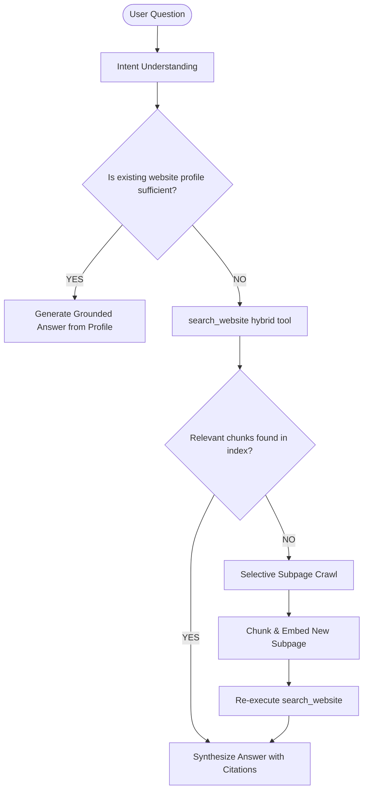

# WebLens AI — Agent Design & Decision Policy

## 1. Why a Single Orchestrator Agent?
Instead of creating dozens of brittle micro-agents that pass unverified text back and forth, WebLens AI relies on a **Single Robust Orchestrator**. 

The orchestrator has access to typed, deterministic backend tools:
1. `validate_url(url)`
2. `fetch_page(url)`
3. `discover_links()`
4. `crawl_page(url)`
5. `search_website(query, top_k)`
6. `retrieve_content(chunk_ids)`
7. `get_website_profile()`
8. `refresh_page(url)`
9. `get_sources()`

## 2. Decision Policy Workflow

## 3. High-Stakes Domain Handling (Medical & Healthcare)
When WebLens analyzes a healthcare or clinical website:
- Claims are strictly summarized with neutral attribution: *"According to the website, the clinic provides X..."*
- Explicit caveat added to the profile limitations: *"This system summarizes public website statements and does not provide medical advice or validate clinical claims."*
