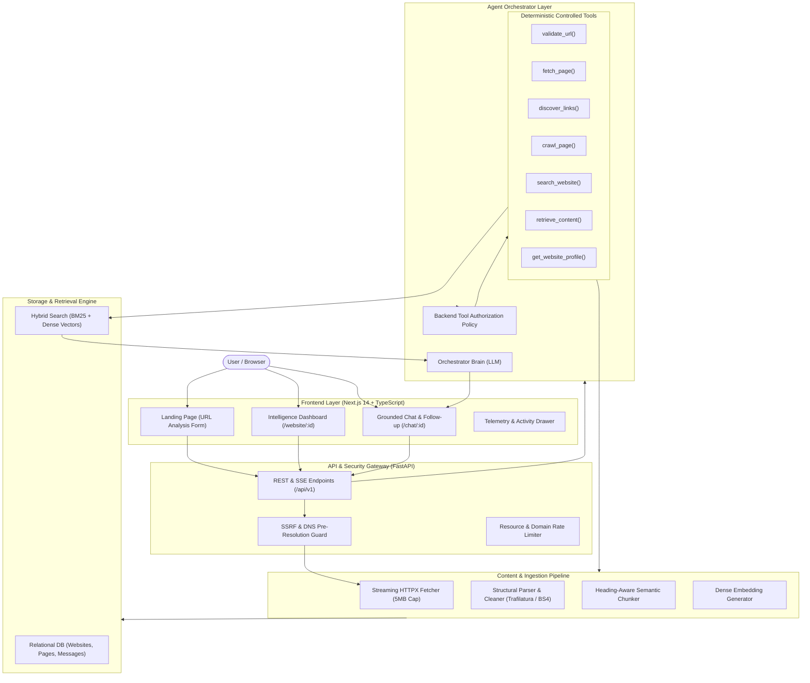

# WebLens AI — System Architecture Blueprint

## Architectural Principles
1. **Decoupled Reasoning & Execution**: The LLM determines the information strategy (intent classification, retrieval requirement, deeper crawling need), but all network fetches and storage operations are executed deterministically by backend tools.
2. **SSRF Defense-in-Depth**: DNS is pre-resolved to evaluate IPv4/IPv6 destination ranges. Every redirect hop is checked before connecting.
3. **Hybrid RAG Pipeline**: Combines Okapi BM25 with dense cosine similarity vectors to balance exact keyword retrieval (e.g., pricing tiers, SKUs) with conceptual queries.
